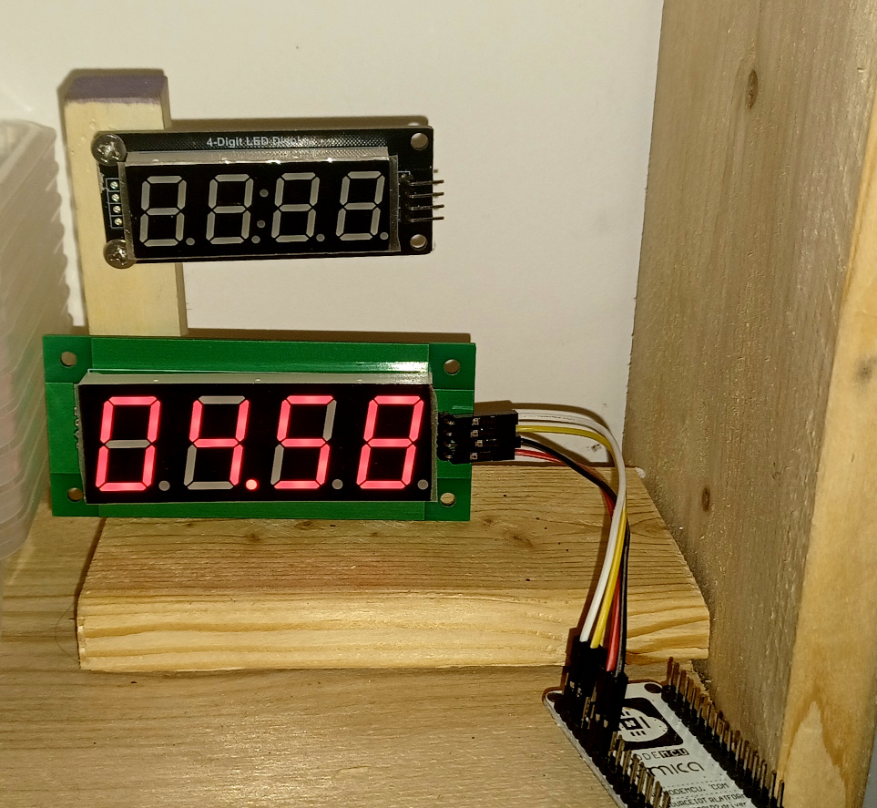

# TM1637 7-Segments 0.80" LED Module

## Introduction

This is a pcb design for the 0.80" LED 7-Segments Display Module. The board is pin compatible with the standard 0.56" LED 7-Segments Display Module

## Features

 * Display numbers
 * Display raw segment data
 * Scrolling text
 * Simplified interface
 * C++ Implementation

ESP32 driver for this board [GitHub cfrankb/esp32-tm1637plus-cpp](https://github.com/cfrankb/esp32-tm1637plus-cpp).

## 0.80" LED Screens Tested 

| Part #    | Size  | Pins |
| --------- | ----- | ---- |
| 8041BS-1  | 0.80" | 12   |
| 8401BS-1F | 0.80" | 14*  |

* Requires a 2.54mm female socket.

## Part List

|     | Part #        | Size   | Package |
| --- | ------------- | ------ | ------- |
| 2x  | 100p C        | C1, C2 | 1206    |
| 1x  | 1k Resistor   | R1     | 1206    |
| 2x  | 10k Resistor  | R2, R3 | 1206    |
| 1x  | Green Led     | D1     | 0805    |
| 1x  | 1u            | C3     | 1206    |
| 1x  | 100u tantalum | C4     | 3216    |

